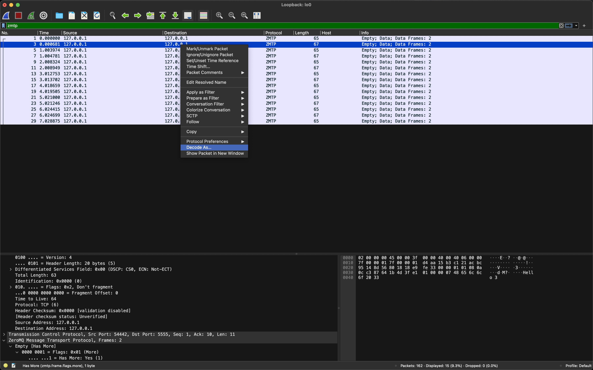
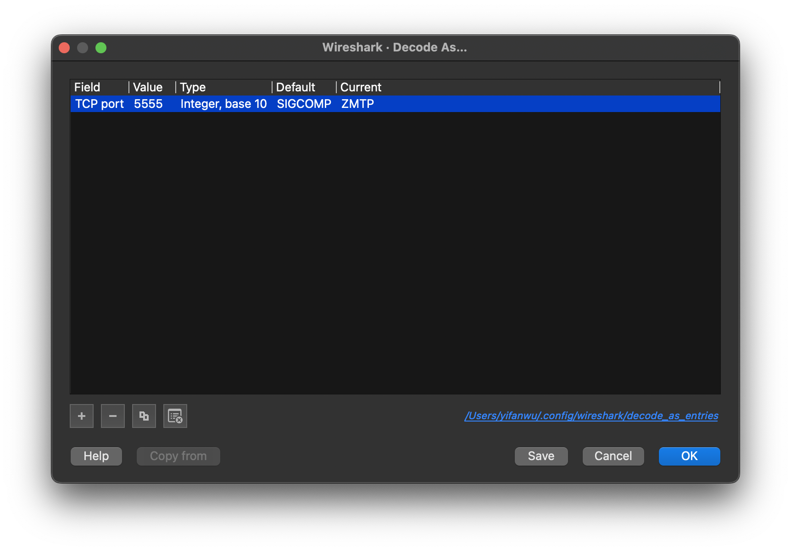

# zmq-playground

## prerequisites

- [pdm](https://github.com/pdm-project/pdm): `2.2.1`
- [Wireshark](https://www.wireshark.org) `4.0.1`
  - `brew install --cask wireshark`

## setup

### python

```sh
pdm install
```

### install [ZMTP Wireshark Dissector](https://github.com/whitequark/zmtp-wireshark)

```sh
mkdir -p ~/.config/wireshark/plugins
git clone https://github.com/whitequark/zmtp-wireshark.git ~/.config/wireshark/plugins/zmtp-wireshark
```

## sniff the packets

start wireshark and capture your loopback

send some messages over the wire

```sh
pdm run simple/server.py
pdm run simple/client.py
```

decode the tcp packets as zmtp





## patterns

### request-reply

```sh
pdm run simple/server.py
```

```sh
pdm run simple/client.py
```

### pub-sub

#### one-to-many

single publisher and multiple subscribers

```sh
pdm run pub_sub/sub.py
```

```sh
pdm run pub_sub/pub.py
```

#### many-to-many

```sh
pdm run xpub_xsub/zproxy.py
```

```sh
pdm run xpub_xsub/ztest.py
```
